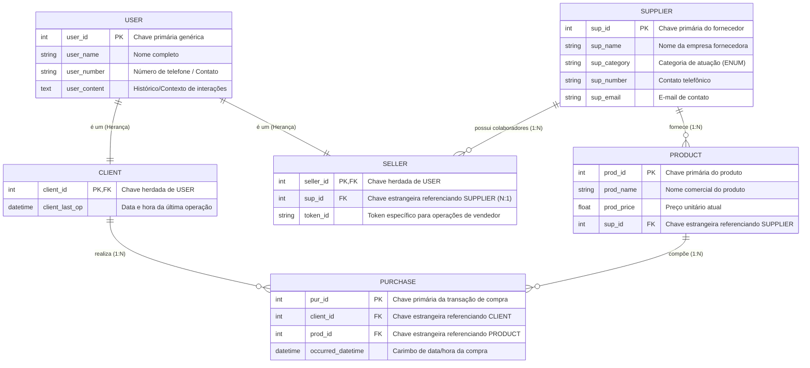

# POC_PI-importadora

## ER-Diagram

```mermaid
erDiagram
    USER {
        int user_id PK "Chave primária genérica"
        string user_name "Nome completo"
        string user_number "Número de telefone / Contato"
        text user_content "Histórico/Contexto de interações"
    }

    CLIENT {
        int client_id PK, FK "Chave herdada de USER"
        datetime client_last_op "Data e hora da última operação"
    }

    SELLER {
        int seller_id PK, FK "Chave herdada de USER"
        int sup_id FK "Chave estrangeira referenciando SUPPLIER (N:1)"
        string token_id "Token específico para operações de vendedor"
    }

    SUPPLIER {
        int sup_id PK "Chave primária do fornecedor"
        string sup_name "Nome da empresa fornecedora"
        string sup_category "Categoria de atuação (ENUM)"
        string sup_number "Contato telefônico"
        string sup_email "E-mail de contato"
    }

    PRODUCT {
        int prod_id PK "Chave primária do produto"
        string prod_name "Nome comercial do produto"
        float prod_price "Preço unitário atual"
        int sup_id FK "Chave estrangeira referenciando SUPPLIER"
    }

    PURCHASE {
        int pur_id PK "Chave primária da transação de compra"
        int client_id FK "Chave estrangeira referenciando CLIENT"
        int prod_id FK "Chave estrangeira referenciando PRODUCT"
        datetime occurred_datetime "Carimbo de data/hora da compra"
    }

    %% Relações de Herança / Generalização
    USER ||--|| CLIENT : "é um (Herança)"
    USER ||--|| SELLER : "é um (Herança)"

    %% Relações do Negócio
    SUPPLIER ||--o{ SELLER : "possui colaboradores (1:N)"
    SUPPLIER ||--o{ PRODUCT : "fornece (1:N)"
    CLIENT ||--o{ PURCHASE : "realiza (1:N)"
    PRODUCT ||--o{ PURCHASE : "compõe (1:N)"
```